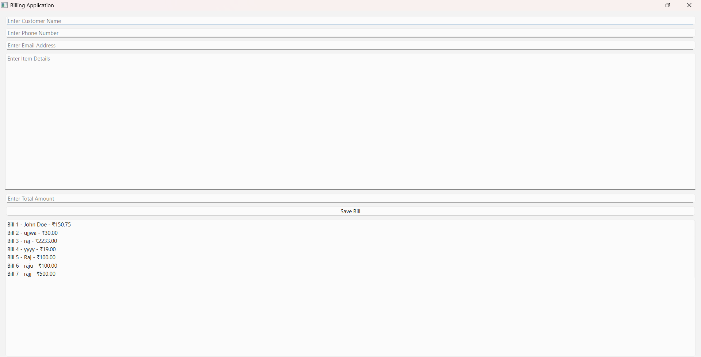
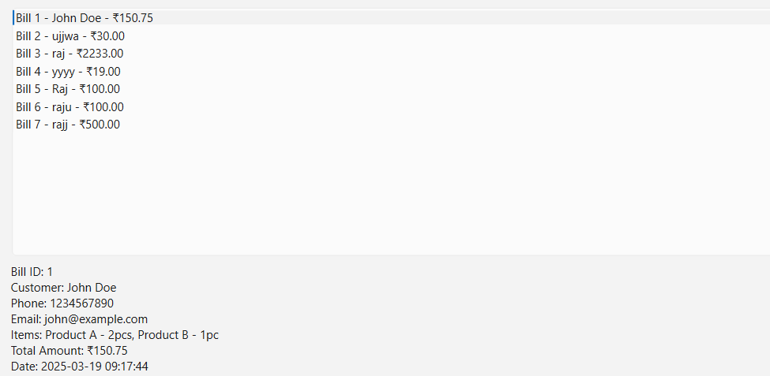

# 📌 BillingApp

A **Billing Management System** built using **PySide6** (for UI) and **MySQL** (for data storage).
It allows users to create and store bills and view saved bills in a table format.

## 📝 Features

✅ Create bills and store them in a MySQL database

✅ Retrieve and display saved bills

✅ UI built using PySide6

✅ Uses .env for secure database credentials

## 🛠 Installation Guide

1️⃣ Install Python

     Download and install Python (if not already installed)

**Check if Python is installed:**
      
      python --version

2️⃣ Install Required Libraries

 **Manually install dependencies:**

       pip install PySide6 mysql-connector-python python-dotenv

3️⃣ Setup MySQL Database

🔹 Open MySQL & Create Database
       
       CREATE DATABASE billing_db;
       USE billing_db;

🔹 Create Customers Table

        CREATE TABLE customers (
          id INT AUTO_INCREMENT PRIMARY KEY,
          name VARCHAR(100) NOT NULL,
          phone VARCHAR(15),
          email VARCHAR(100)
        );
 
🔹 Create Bills Table

        CREATE TABLE bills (
          id INT AUTO_INCREMENT PRIMARY KEY,
          customer_id INT,
          item_details TEXT,
          total_amount DECIMAL(10,2),
          bill_date TIMESTAMP DEFAULT CURRENT_TIMESTAMP,
          FOREIGN KEY (customer_id) REFERENCES customers(id)
         );

  
4️⃣ Configure .env for Secure MySQL Connection

Create a .env file in the project folder and add:

          MYSQL_HOST=localhost
          MYSQL_USER=root
          MYSQL_PASSWORD=your_password
          MYSQL_DATABASE=billing_db

Replace your_password with your actual MySQL password.

5️⃣ Run the Application
   
   🔹 Initialize the Database (First Time Only)
            
            python setup_database.py

   🔹 Start the Application

            python main.py

## Screenshots
 **Sample Image of Application**

## 🎯Usage

  1️⃣ Enter customer details & bill details → Click "Save Bill"

  2️⃣ View saved bills in the list

  3️⃣ Click on a bill to see details

